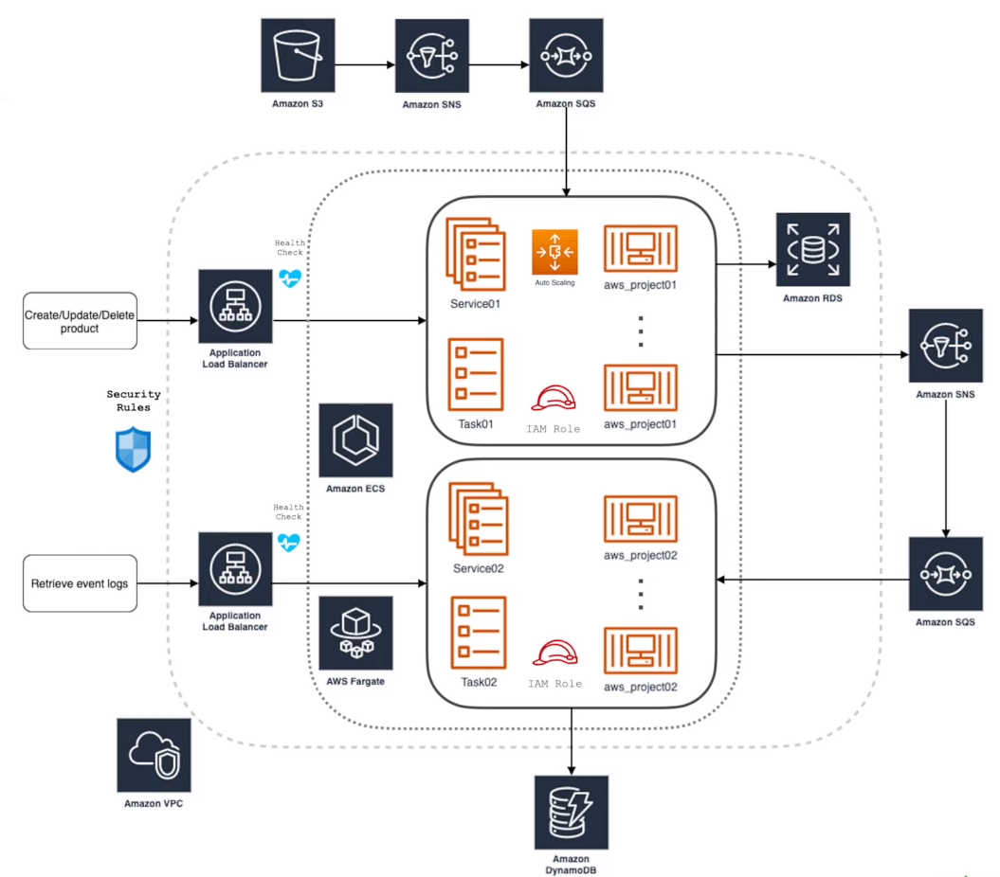

#  Microsserviços em Java com AWS ECS Fargate e AWS CDK

Este projeto é composto por dois microservices em Java utilizando o framework Spring Boot. A aplicação funciona como um
backend e interage com recursos da Amazon Web Services (AWS). A criação desses recursos na AWS será realizada por meio do
AWS Cloud Development Kit (CDK).

## Arquitetura do projeto

## Sobre a arquitetura
- As duas aplicações estão em um Cluster Fargate dentro de uma [**VPC**](https://docs.aws.amazon.com/pt_br/vpc/latest/userguide/what-is-amazon-vpc.html)
- A primeira aplicação é um CRUD que é persistido no [**RDS**](https://aws.amazon.com/pt/rds/) e publica mensagem em um tópico [**SNS**](https://aws.amazon.com/pt/sns/)
- Há também um endpoint que retorna uma Url pré-assinalada para envio de Arquivos para o [**S3**](https://aws.amazon.com/pt/s3/), este evento é trigado em um tópico SNS que por sua vez é consumido por um SQS e persistido no RDS
- A segunda aplicação é uma fila [**SQS**](https://aws.amazon.com/pt/sqs/) que lê as informações recebidas do SNS e persiste no [**DynamoDB**](https://aws.amazon.com/pt/pm/dynamodb/?trk=3e4c2258-4f21-4854-9de7-2f6da2ef0989&sc_channel=ps&ef_id=CjwKCAiA1-6sBhAoEiwArqlGPiTxeputm_BRbu4v260T3LJHQI1YLDt4_i5IAM3XwbKwu-oPU_P_7RoCsBUQAvD_BwE:G:s&s_kwcid=AL!4422!3!589951433441!e!!g!!dynamodb!16393976581!133547551333&gclid=CjwKCAiA1-6sBhAoEiwArqlGPiTxeputm_BRbu4v260T3LJHQI1YLDt4_i5IAM3XwbKwu-oPU_P_7RoCsBUQAvD_BwE)

## API endpoints
- Importar coleção da raiz do projeto:  **aws_project.postman_collection.json**

## Rodando Local

- Necessário rodar a localStack com o comando:`docker run --rm -p 4566:4566 -p 4571:4571 localstack/localstack -e "SERVICES=sns, sqs, dynamodb, s3"`
- Adicionar a Environment variable `spring.profiles.active=local` para carregar as configurações locais
  
